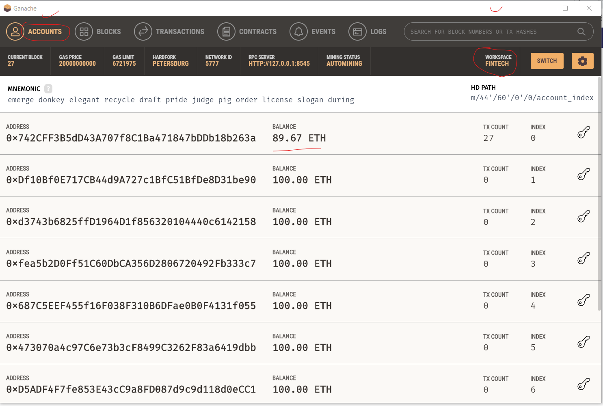
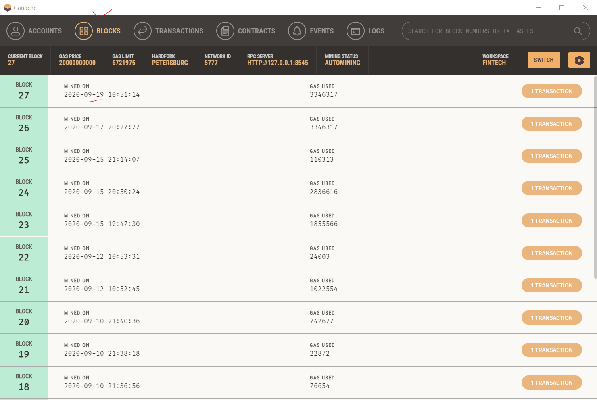
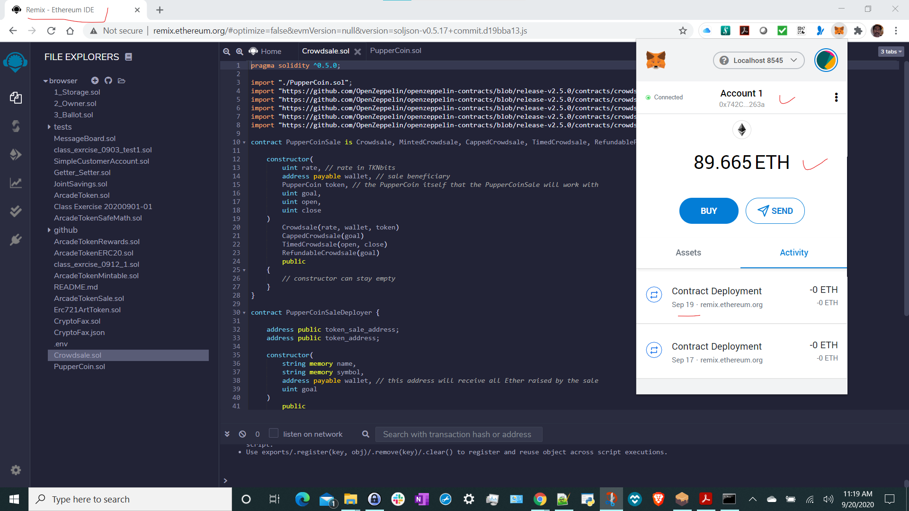
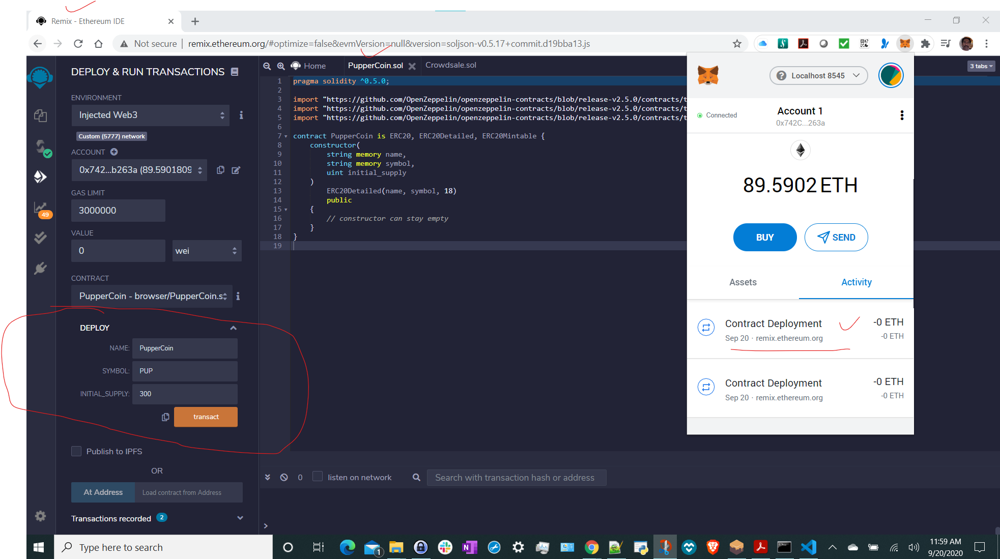
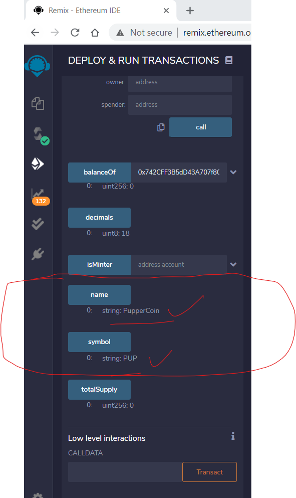
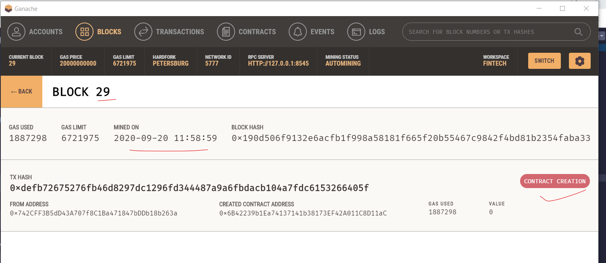
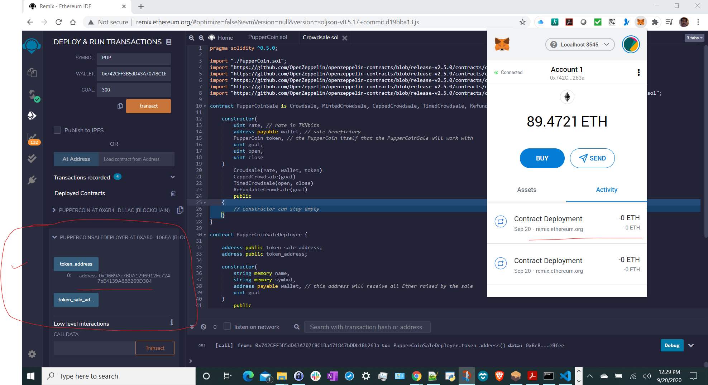
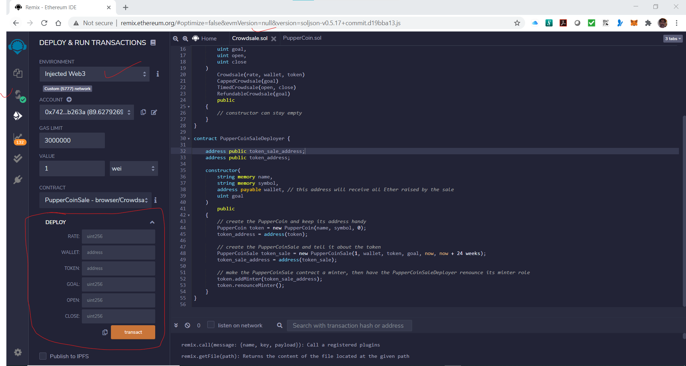

# Unit21_Adv_Solidity
This Repo is used to try Advanced Solidity features for crowdsale the PupperCoin token in order to help fund the network development. This network will be used to track the dog breeding activity across the globe in a decentralized way, and allow humans to track the genetic trail of their pets
Developer: Subbaiah Choudary Kotha (KS)
Date: 9/20/2020

## Detailed Steps:
### Launch Ganache
Step-1: Launch Ganache and check the status of account as shown below:

a) Check the Tab: Accounts

b) Check the Tab: Blocks

### Creating and Designing the project
Step-2: Launch Chrome and open Remix, check the Metamask and select the Localhost 8545 and login to the account.

Step-3: Complete coding in a) PupperCoin.sol and b) Crowdsale.sol 

Step-4: Complile the above 2 programs

Step-5: Deploy PupperCoin

a) Check Deployment  status

b) Check Variables

c) Check Ganache

Step-6: Deploy PupperCoinCrowdsaleDeployer

Step-7: Deploy PupperCoinCrowdsale

Step-8: Test Contract
